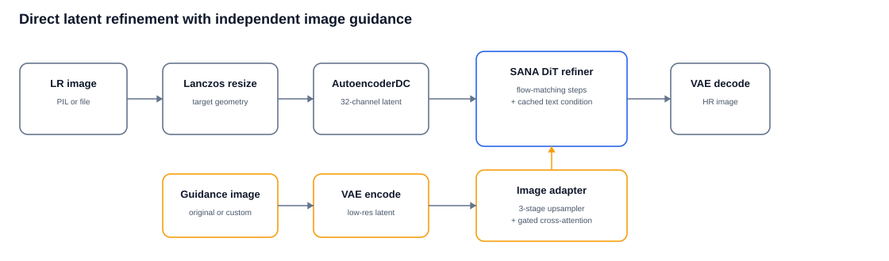
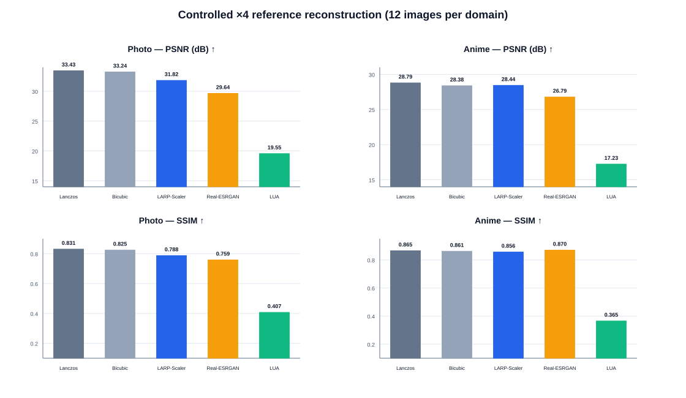
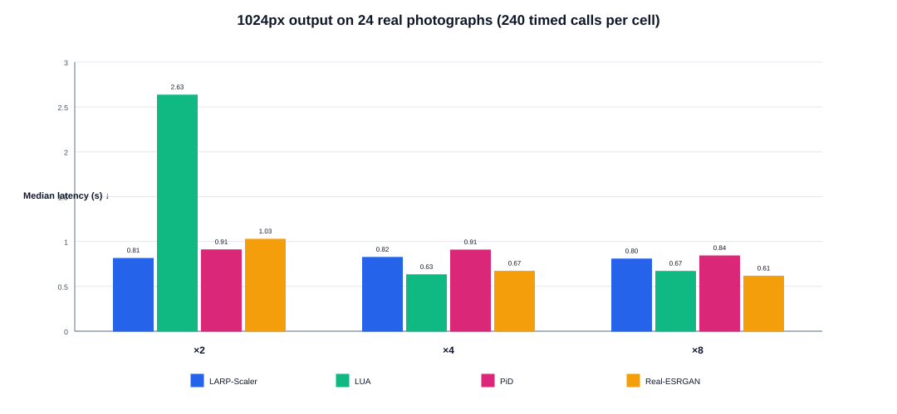
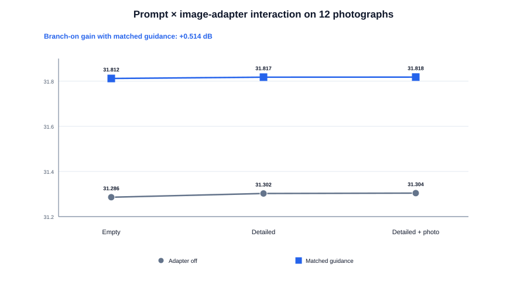
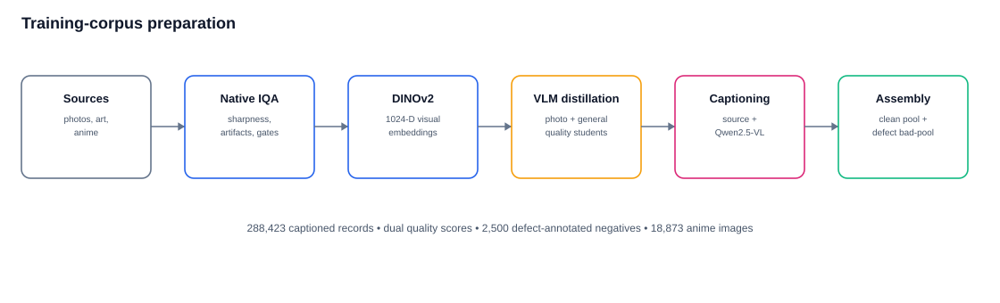
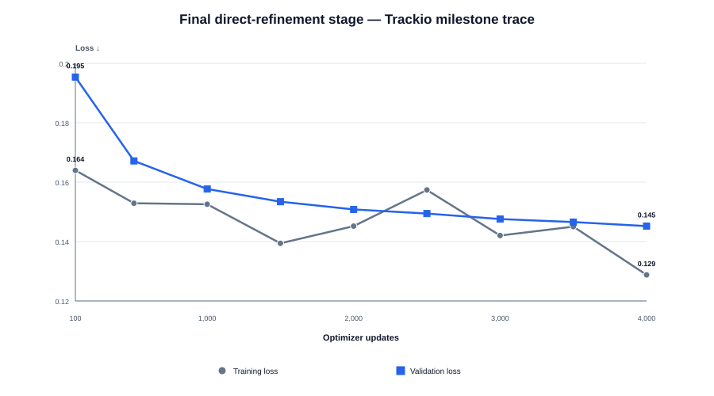

# LARP-Scaler

**LAtent super-Resolution high-Performance image upscaler**

[](https://huggingface.co/VladimirM388/larpscaler-v2-bf16)
[](https://colab.research.google.com/github/Vovanm88/LARP-Scaler/blob/main/notebooks/larpscaler_inference.ipynb)
[](https://github.com/Vovanm88/LARP-Scaler)
[](LICENSE)

LARP-Scaler is a SANA-based image upscaler that directly refines a resized
image in a 32-channel latent space. It supports **×2, ×4, and ×8** enlargement,
uses an independent image-guidance adapter, and includes tiled VAE and DiT
inference for images that do not fit in a single forward pass.

> **Release TODO:** add the public Gradio URL and the arXiv/Paper Page link.
> The future repository PDF will live at `paper/LARP-Scaler.pdf`; it is
> intentionally not included in this draft release.

<p align="center">
  
</p>

## Highlights

- **Direct latent refinement.** A SANA transformer refines the latent encoding
  of a conventionally resized image instead of running a separate pixel-space
  restoration network.
- **Image-guided detail.** A three-stage guidance branch injects the original
  low-resolution image through zero-initialized gated cross-attention.
- **Text-encoder-free runtime.** Positive and empty prompt tensors are stored in
  the checkpoint; inference does not load a text encoder.
- **Practical large-image inference.** AutoencoderDC handles VAE tiling and the
  DiT uses overlapped latent tiles, Hann blending, shifted grids between steps,
  automatic tile batching, and CUDA OOM backoff.
- **Controlled reconstruction results.** On the 12-photo ×4 benchmark described
  below, LARP-Scaler reaches **31.817 dB PSNR**, compared with 29.641 dB for
  Real-ESRGAN and 16.707 dB for PiD.

## Links

| Resource | Link |
|---|---|
| Model weights | [VladimirM388/larpscaler-v2-bf16](https://huggingface.co/VladimirM388/larpscaler-v2-bf16) |
| Colab notebook | [Open `larpscaler_inference.ipynb`](https://colab.research.google.com/github/Vovanm88/LARP-Scaler/blob/main/notebooks/larpscaler_inference.ipynb) |
| Source code | [Vovanm88/LARP-Scaler](https://github.com/Vovanm88/LARP-Scaler) |
| Gradio demo | **TODO:** add the public Space URL |
| Paper | **TODO:** add the arXiv and Hugging Face Paper Page URLs |

## Installation

Python 3.10 or later is required. A recent CUDA GPU is strongly recommended;
the released checkpoint is intended for BF16 inference.

```bash
pip install "git+https://github.com/Vovanm88/LARP-Scaler.git"
```

For local development:

```bash
git clone https://github.com/Vovanm88/LARP-Scaler.git
cd LARP-Scaler
pip install -e ".[dev,notebook]"
```

## Python API

### Quality preset

This is the expressive four-step preset used by the example notebook.

```python
from larpscaler import LarpScaler

upscaler = LarpScaler.from_pretrained(
    "VladimirM388/larpscaler-v2-bf16",
)

image = upscaler.upscale(
    "input.png",
    scale=4,
    steps=4,
    noise_level=1.0,
    guidance_scale=4.5,
    seed=1234,
)
image.save("output.png")
```

### Fast reconstruction preset

For lower latency and strong pixel reconstruction on the measured photo
protocol, use one refinement step:

```python
image = upscaler.upscale(
    "input.png",
    scale=4,
    steps=1,
    noise_level=0.35,
    guidance_scale=1.0,
    seed=1234,
)
image.save("output-fast.png")
```

### Custom guidance and large-image options

By default, the input image is also used as the guidance image. A different
image can be supplied for controlled ablations or specialized workflows:

```python
image = upscaler.upscale(
    "input.png",
    adapter_image="guidance.png",
    scale=8,
    steps=1,
    noise_level=0.35,
    guidance_scale=1.0,
    conditioning_scale=1.0,
    tile_size=1024,
    tile_overlap=256,
    tile_batch_size="auto",
)
```

Set `use_image_adapter=False` to disable the image-guidance branch. This keeps
the trained LARP-Scaler backbone; it does **not** restore the original upstream
SANA weights.

## Command line

Installing the package exposes the `larpscale` command:

```bash
larpscale input.png output.png \
  --model VladimirM388/larpscaler-v2-bf16 \
  --scale 4 \
  --steps 1 \
  --noise-level 0.35 \
  --guidance-scale 1.0
```

The CLI exposes the common inference controls. Use the Python API for custom
adapter images and explicit tile geometry.

## Controlled reconstruction quality

The following results use reference reconstruction rather than aesthetic
preference: a known 512×512 target is downsampled to 128×128 with Lanczos and
then reconstructed at ×4. Each domain contains 12 images. Higher PSNR and SSIM
are better; lower MAE is better.

### Real photographs

| Method | PSNR, dB ↑ | SSIM ↑ | MAE ↓ |
|---|---:|---:|---:|
| **LARP-Scaler** | **31.8170** | **0.7877** | **0.02314** |
| Real-ESRGAN ×4 | 29.6409 | 0.7587 | 0.02846 |
| LUA-Flux ×4 | 19.5536 | 0.4071 | 0.09247 |
| PiD-Flux ×4 | 16.7071 | 0.1771 | 0.11737 |

### Anime images

| Method | PSNR, dB ↑ | SSIM ↑ | MAE ↓ |
|---|---:|---:|---:|
| **LARP-Scaler** | **28.4394** | 0.8560 | **0.02382** |
| Real-ESRGAN ×4 | 26.7850 | **0.8695** | 0.02559 |
| LUA-Flux ×4 | 17.2268 | 0.3653 | 0.10970 |
| PiD-Flux ×4 | 15.7724 | 0.2218 | 0.12221 |

LARP-Scaler has the highest PSNR and lowest MAE in both controlled sets.
Real-ESRGAN has slightly higher SSIM on anime (0.8695 versus 0.8560). PiD is a
perceptual pixel-diffusion decoder and LUA is a single-pass feed-forward latent
adapter; both optimize objectives other than exact reference reconstruction, so
their values here should not be read as an aesthetic ranking.

<p align="center">
  
</p>

## End-to-end latency

Latency was measured on an NVIDIA GeForce RTX 5090 with models already in VRAM.
The interval includes file open, preprocessing, VAE encode when applicable,
inference, and final image conversion. It excludes model loading and writing the
result to disk.

The expanded test contains 24 real photographs, three warm-up calls and ten
timed calls per image, method, and scale: **240 timed calls per table cell**.
Inputs may be large native JPEG files, so the values represent end-to-end file
processing rather than GPU-only kernel time.

| Method | ×2 median, s ↓ | ×4 median, s ↓ | ×8 median, s ↓ |
|---|---:|---:|---:|
| LARP-Scaler | 0.8119 | 0.8227 | 0.8047 |
| LUA-Flux | 2.6323 | **0.6291** | 0.6668 |
| PiD-Flux | 0.9069 | 0.9050 | 0.8397 |
| Real-ESRGAN ×4 | 1.0253 | 0.6681 | **0.6134** |

At ×4, LARP-Scaler is faster than PiD in this protocol, but slower than LUA and
Real-ESRGAN. The comparison therefore supports competitive latency, not a claim
of being universally fastest.

<p align="center">
  
</p>

## Prompt and image-adapter ablation

The ablation uses the same 12 real photographs, 128→512 ×4 reconstruction, one
step, `noise_level=0.35`, `guidance_scale=1`, BF16, and seed 1234.

| Change | ΔPSNR, dB | Approx. MSE reduction |
|---|---:|---:|
| Detailed prompt, adapter off | +0.0166 | 0.38% |
| Detailed prompt, correct adapter | +0.0057 | 0.13% |
| Correct adapter, tagged prompt | **+0.5138** | **11.16%** |
| Correct vs. wrong guidance image | +0.0788 | 1.80% |

The trained backbone contributes most of the gain over upstream SANA: on these
same 12 photographs and the same one-step protocol, the released checkpoint
scores 31.8178 dB against 21.2628 dB for the untrained SANA backbone, a
**10.555 dB** difference. Within the trained model, the image adapter
contributes roughly half a decibel, while the cached prompt provides a smaller
positive change. These effects should not be added across different benchmark
protocols.

<p align="center">
  
</p>

## Training corpus

The training metadata contains **288,423** captioned records from photographic,
art, and anime sources. Images were profiled at native resolution, embedded
with DINOv2-large, scored by two VLM-distilled quality students, filtered with
content-aware deterministic gates, and captioned from source metadata or a
local VLM. A 2,500-image defect-labelled bad pool was retained as
quality-conditioned negative data.

<p align="center">
  
</p>

More detail and the exact source counts are included in the paper draft.

## Training recipe

The released checkpoint was initialized from
`supups-upscaler-v1-sft/checkpoint-6000` and then trained for **4,000**
direct-refinement updates. This final stage used 1024px crops, BF16,
DeepSpeed ZeRO-2, AdamW (`lr=2e-5`, weight decay `0.01`), and an effective
batch size of **96**: three RTX 5090 training processes × batch 2 × 16 gradient
accumulation steps. The fourth RTX 5090 produced the online VAE cache.

The logged objective was:

```text
loss = flow_loss + 0.3 × reconstruction_loss + 0.5 × high_frequency_loss
```

The final stage took **13 h 36 min 46 s**. Trackio validation loss decreased
from 0.1954 at update 100 to 0.1452 at update 4,000. This duration is not a
claim about total SANA pretraining or the complete predecessor-checkpoint
history.

<p align="center">
  
</p>

The exact recovered config, run IDs, checkpoint hash, loss components, and
milestones are stored in
[`paper/data/training_run.json`](paper/data/training_run.json).

## Large-image inference

LARP-Scaler uses two distinct tiling systems:

1. **VAE tiling** is owned by `AutoencoderDC.enable_tiling`. The pipeline does
   not place a second manual VAE tiler around it.
2. **DiT tiling** runs in latent space. Overlapping predictions are blended
   with a two-dimensional Hann window and normalized by accumulated weights.

The DiT grid shifts by half a stride on alternating steps, reducing persistent
tile boundaries. `tile_batch_size="auto"` estimates a conservative batch size
from free accelerator memory, starts at no more than 16 tiles, and halves the
batch following CUDA out-of-memory errors. Latent accumulation and overlap
weights use FP32; model passes use the checkpoint dtype.

## Reproducing the figures

Benchmark numbers are stored in
[`paper/data/benchmarks.json`](paper/data/benchmarks.json); final-stage
training provenance and milestones are in
[`paper/data/training_run.json`](paper/data/training_run.json).

```bash
python paper/scripts/make_figures.py
```

This writes matching SVG files for GitHub and PDF files for LaTeX. The
qualitative montage is intentionally absent until real LR, baseline,
LARP-Scaler, and ground-truth images are added. Its manifest format is
documented in [`paper/qualitative/README.md`](paper/qualitative/README.md).

## Limitations

- The direct quality comparisons contain 12 photo and 12 anime images. They are
  useful controlled tests, but not a broad public benchmark.
- PSNR, SSIM, and MAE reward exact reconstruction. They do not fully measure
  perceptual preference and can penalize plausible generated details.
- LPIPS, DISTS, FID, and human-preference results are not yet available.
- Reported speed measurements use one GPU family: NVIDIA GeForce RTX 5090.
- LUA multi-scale matrices at ×2 and ×8, and its synthetic and mixed-aspect
  sets, are kept out of the shared ×4 tables; only the ×4 run on the identical
  12 images is merged.
- The recovered 13.6-hour training trace covers the final direct-refinement
  stage, not upstream SANA pretraining or the complete predecessor-checkpoint
  lineage.
- Access to computational resources was limited. Development, final-stage
  training, ablations, and evaluation used one four-GPU RTX 5090 machine,
  limiting broad hyperparameter sweeps, multi-seed training, and larger-scale
  evaluation.
- The public paper draft still requires qualitative examples and release URLs.

## Citation

Until the arXiv record is available, cite the software release:

```bibtex
@misc{melnikov2026larpscaler,
  title        = {LARP-Scaler: Latent Super-Resolution High-Performance Image Upscaler},
  author       = {Vladimir Melnikov and Maxim Manushin and Ilya Kuleshov},
  year         = {2026},
  howpublished = {\url{https://github.com/Vovanm88/LARP-Scaler}}
}
```

**TODO after release:** replace this entry with the arXiv citation and add the
arXiv URL to this README so Hugging Face can associate the model and demo with
the corresponding Paper Page.

## License

The source code is released under the [Apache License 2.0](LICENSE). Model
weights and upstream components may carry their own terms; review the model
card and upstream licenses before redistribution.
